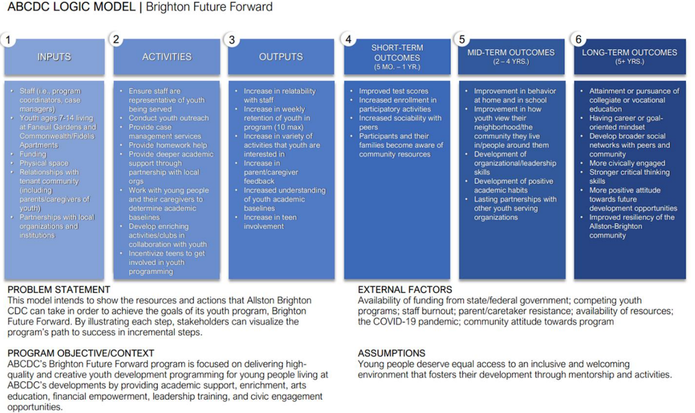

As part of another project, I was assigned to a team to evaluate a youth development program for the Allston Brighton Community Development Corporation (ABCDC). The program was given a grant by Senator Brownsberger for a youth development program for children who live in rough neighborhoods. As external evaluators, it was our responsibility to research similar youth programs and then show the best practices used there to engage the youth. Since it is a new program, ABCDC wanted us to measure the feasibility of such a program. ABDCD would then begin to develop the Brighton Future Forward (BFF) program. Brighton Future Forward (BFF) provides youth programming to young people aged 7-14 living at two Allston-Brighton CDC properties: Faneuil Gardens and Commonwealth/Fidelis Way Apartments. BFF aims to develop young people in a holistic manner by providing academic support, and by providing enriching activities that foster social/behavioral development. As external evaluators, it was our responsibility to research similar youth programs and then show the best practices used there to engage the youth.

After several weeks of research and discussions with the client, our team created a logic model to visualize the the various goals, challenges, and assets the BFF program currently had. Providing this visual is an important step in not only evaluation, but in other program developments as it provides a clear and concise way of relaying vital information to the client and the people who work to advance the program. Various people within the program will have different levels of knowledge and experience with the program and having this visual aligns everyone to the same page and what to expect in the near and far future. 

Visuals like this logic model are much more suited towards conveying a lot of information quickly and effectively. While it is entirely possible provide all this information as a memo or report, it would not have the same impact as a visual such as this. Being able to visualize data, such as a logic model, maps, or statistical output, is an important aspect as an analyst. It is not enough to simply provide a regression model or other analysis if nobody is able to remember, let alone understand, what is being presented.  

