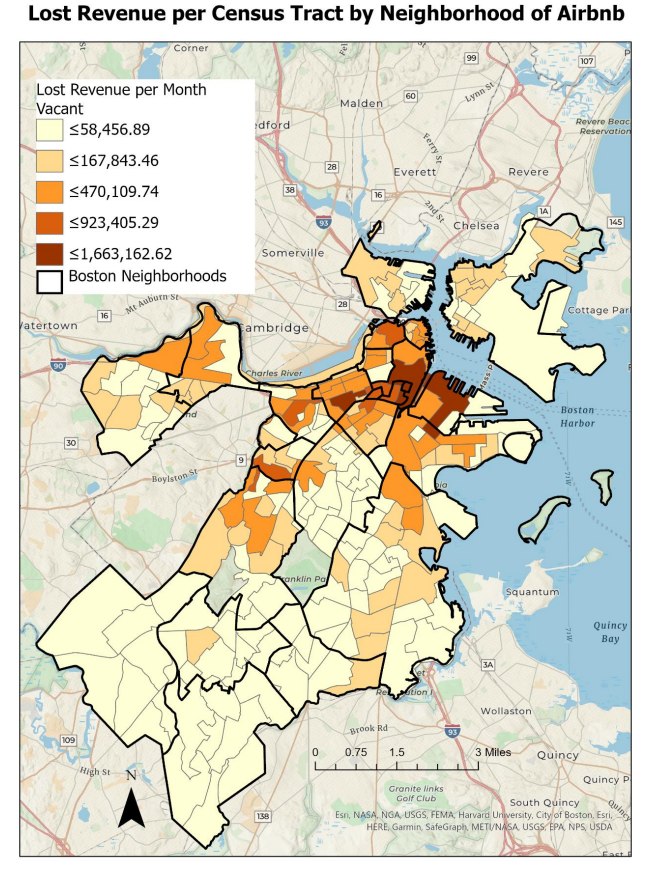

A pandemic on the scale of Covid-19 has done a lot to change our understanding on how businesses and people can survive and function. Having such a high element of uncertainty poses the question on how to handle it. Some individuals may choose to operation as close to normal as possible, maintaining a sense of consistency and others may choose to be more conservative in their actions in order to try and survive for an unknown amount of time. It depends on who or what industries they are a part of or how they perceive the future to look. Many service industries and jobs are particularly affected by how the mechanics of the virus and how it spreads while other data analytic jobs remain largely unchanged due to being able to operate online and using cloud computing services to maintain and distribute their information. This post will briefly explain one of the changes that have occurred specifically to the Airbnb business in Boston.

Intuitively, we can conclude that tourist areas may be prime locations for rentals since if a listing is closer to tourist spots, it will be more convenient for travels to stay there since other expenses such as trolly or ride sharing costs will be lower. While being able to show a map of the listings may be helpful, ultimately it does not tell us much about where listings are since it ends up being an indistinguishable amalgamation of cluster points. 

If we were to look at the median household income of 2019 in Boston, we would notice that not only is there an income inequality problem, the income is skewed towards the towards the peripherals of Boston. The peripheral neighborhoods, in this case, are Back Bay and Jamaica Plain whereas center 
neighborhoods would be Roxbury and Mattapan. As such, different neighborhoods with different levels of Airbnb activity have greater potential lost revenue from the pandemic. 

Here we can see the total potential loss by census tract. There are a couple of noteworthy details to point out. First, the vast majority of tracts fall into the lowest category. Based on the proximity to the downtown area, this is generally not surprising, as hosts will try to have listings 
available to the city attractions as well as basing the prices of the cost of living in the area in order to maintain the property. Downtown, Back Bay, and Fenway generally are more expensive overall so hosts will adjust their pricing to match. An exception to this would be the neighborhood of 
West Roxbury, whose median income is towards the higher end but shows a low potential loss of income. 

That was a very brief overview of one of the aspects of Airbnb businesses during the Covid pandemic. There has been much more research, including from myself, done on the topic that far exceeds the scope of a post but I hope this brief introduction to the topic sparked some interest!